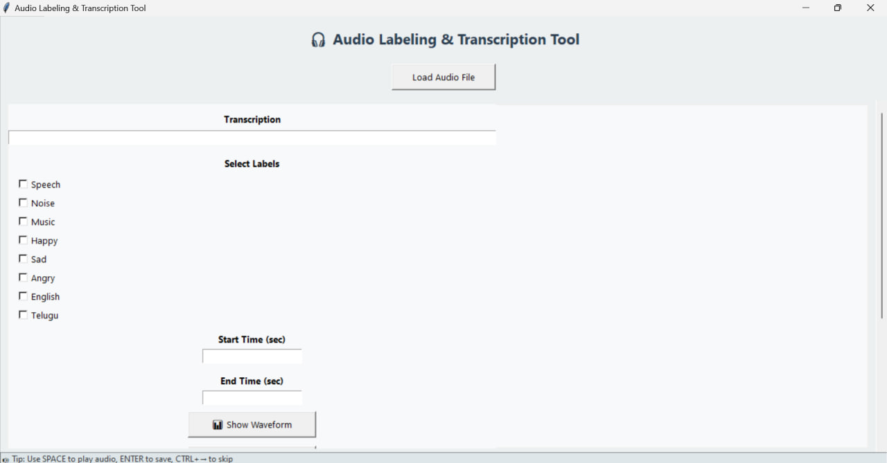
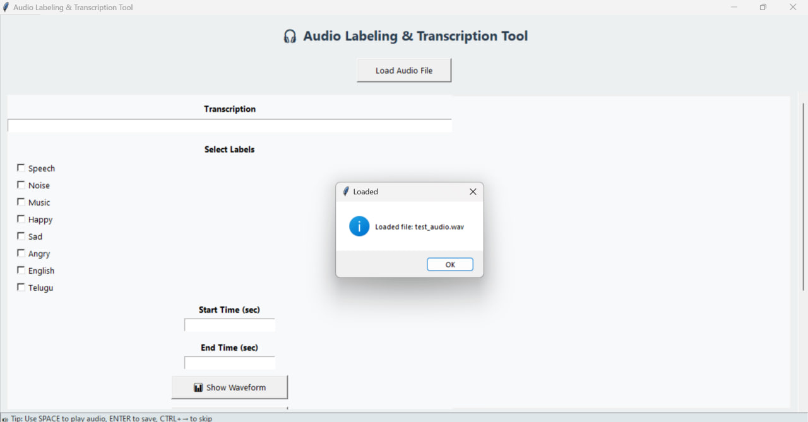
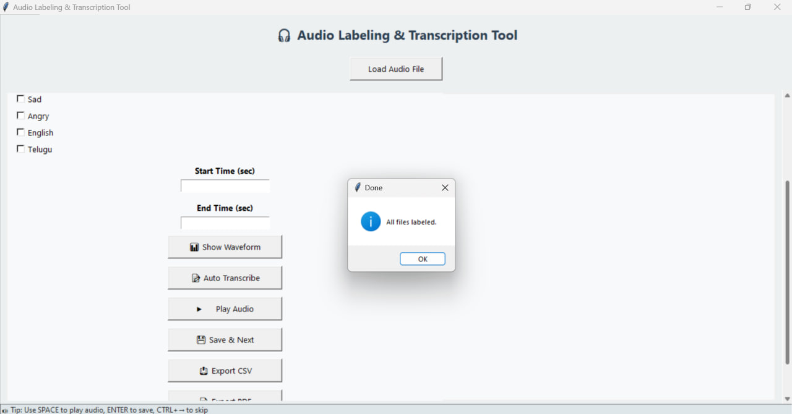
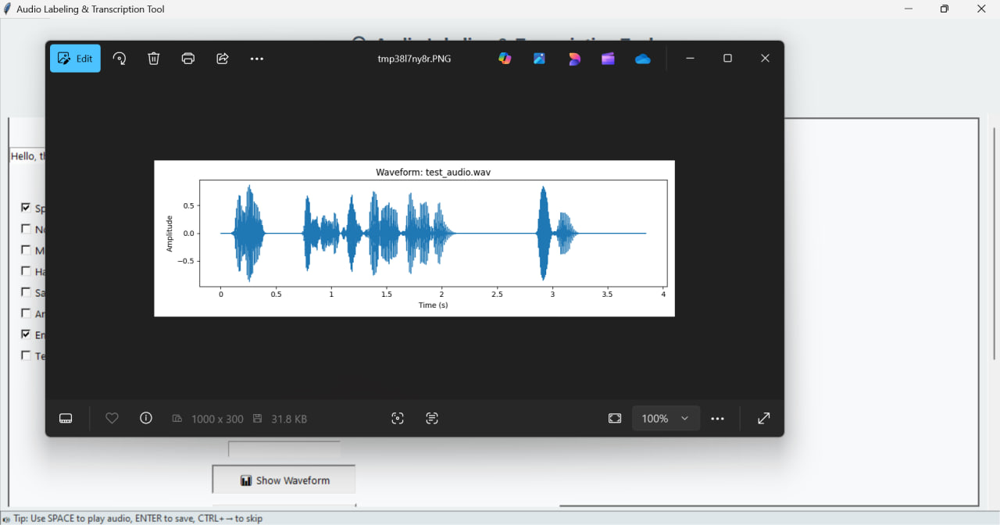
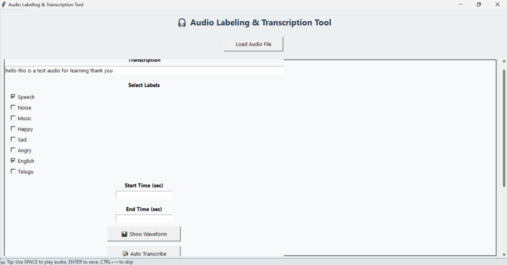
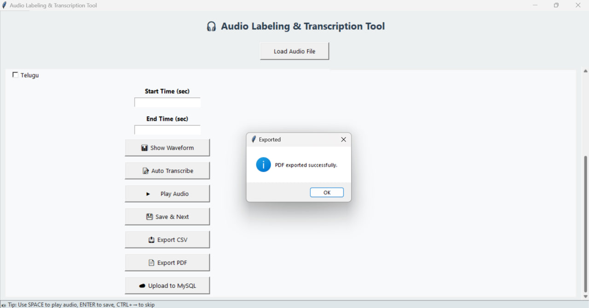
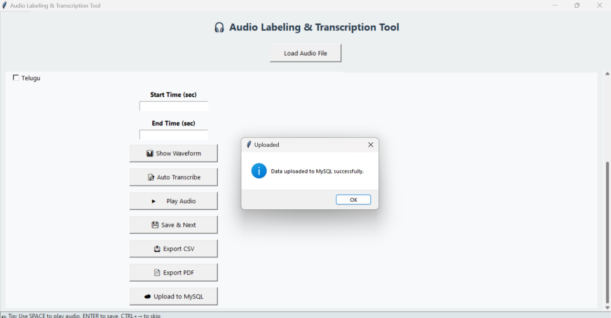

# 🎧 Audio Labeling & Transcription Tool

A full-featured tool to annotate audio clips with real-time waveform display and transcription using AI.

## 📌 Features
- Real-time waveform visualization
- AI-based transcription
- Multi-label annotation
- CSV, PDF, and MySQL export

## 🧰 Tech Stack
Python, Tkinter, Librosa, SpeechRecognition, Matplotlib, MySQL

## 🚀 Setup
```bash
git clone https://github.com/jetti-charanteja/Audio-Labelling-Tool.git
cd Audio-Labelling-Tool
pip install -r requirements.txt
python main.py
```

## 📸 Screenshots

### Main UI


### Audio Upload


### Play Audio
<html lang="en">
<head>
  <meta charset="UTF-8">
  <title>Play Audio</title>
</head>
<body>
  <video src="IMAGES/play_audio.mp4" autoplay controls muted style="width:100%; height:auto;"></video>
</body>
</html>


### Manual Transcription


### Save and Next


### Waveform


### Auto Transcribe


### CSV Export


### PDF Download


### SQL Upload



## 🙋‍♂️ Author
Jetti Charan Teja Naga Sai
